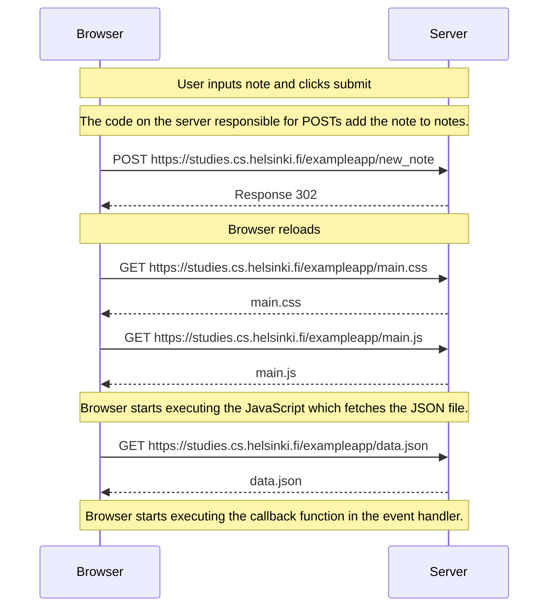

```mermaid

    sequenceDiagram
        Note over Browser, Server: User inputs note and clicks submit

        Note over Browser, Server: The code on the server responsible for POSTs add the note to notes.

        Browser->>Server: POST https://studies.cs.helsinki.fi/exampleapp/new_note
        Server-->>Browser: Response 302

        Note over Browser, Server: Browser reloads

        Browser->>Server: GET https://studies.cs.helsinki.fi/exampleapp/main.css
        Server-->>Browser: main.css

        Browser->>Server: GET https://studies.cs.helsinki.fi/exampleapp/main.js
        Server-->>Browser: main.js

        Note over Browser, Server: Browser starts executing the JavaScript which fetches the JSON file.

        Browser->>Server: GET https://studies.cs.helsinki.fi/exampleapp/data.json
        Server-->>Browser: data.json

        Note over Browser, Server: Browser starts executing the callback function in the event handler.

```