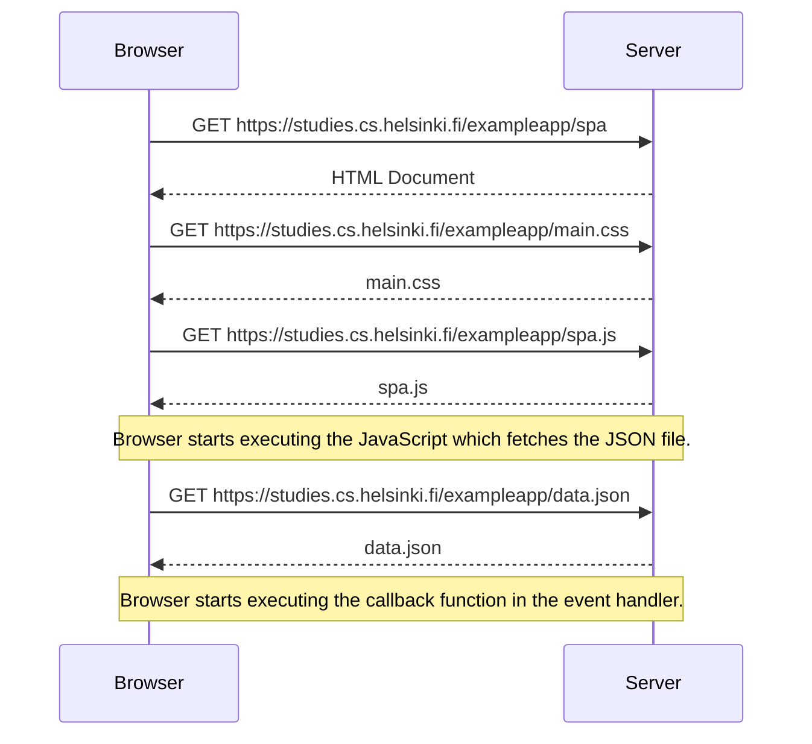

```mermaid 

    sequenceDiagram
        Browser->>Server: GET https://studies.cs.helsinki.fi/exampleapp/spa
        Server-->>Browser: HTML Document

        Browser->>Server: GET https://studies.cs.helsinki.fi/exampleapp/main.css
        Server-->>Browser: main.css

        Browser->>Server: GET https://studies.cs.helsinki.fi/exampleapp/spa.js
        Server-->>Browser: spa.js

        Note over Browser, Server: Browser starts executing the JavaScript which fetches the JSON file.

        Browser->>Server: GET https://studies.cs.helsinki.fi/exampleapp/data.json
        Server-->>Browser: data.json

        Note over Browser, Server: Browser starts executing the callback function in the event handler.
        
```