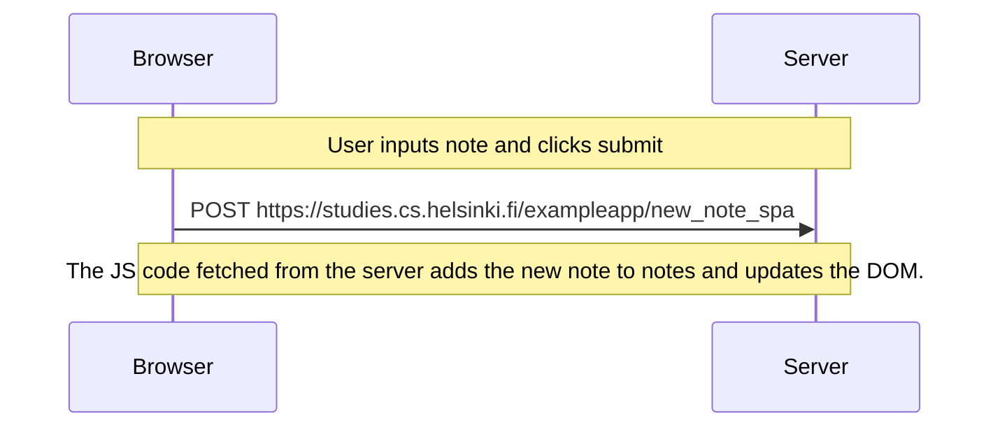

```mermaid

    sequenceDiagram
        Note over Browser, Server: User inputs note and clicks submit

        Browser->>Server: POST https://studies.cs.helsinki.fi/exampleapp/new_note_spa

        Note over Browser, Server: The JS code fetched from the server adds the new note to notes and updates the DOM.

```